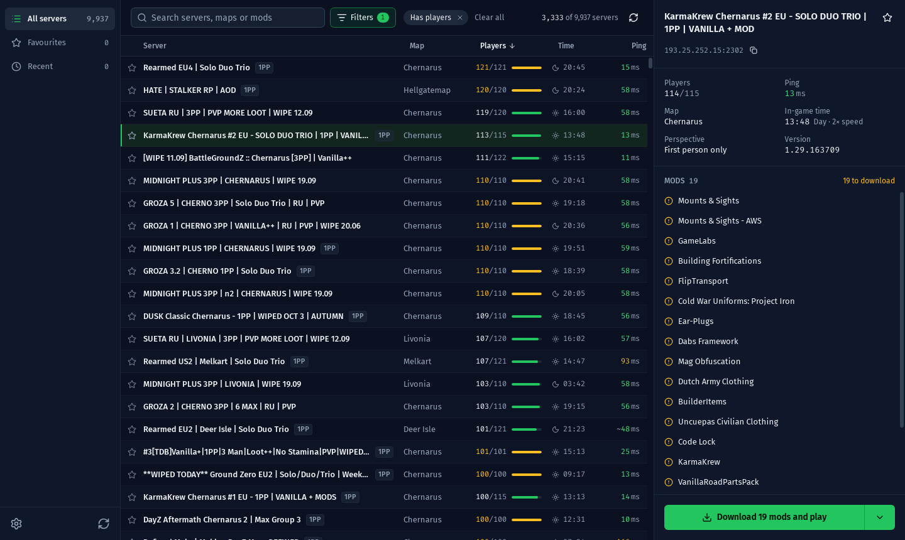

# Flare Launcher

Find a server. Get the mods. Jump straight in.

Flare Launcher is a server browser and mod launcher for DayZ, for Windows and Linux. Pick a server and press Play: it
downloads the mods that server needs through Steam, then starts the game and joins.

## Download

Get the latest version from **[flarelauncher.app](https://flarelauncher.app)**. It picks
the right download for your computer. The launcher keeps itself up to date after that. See what changed in each
version in [CHANGELOG.md](CHANGELOG.md).

You need Steam with DayZ installed.

- **Windows 10 and 11:** run the installer. Windows may say it protected your PC because the installer isn't signed
  yet: choose More info, then Run anyway.
- **Linux:** choose the `.deb` (Ubuntu, Debian, Mint), the `.rpm` (Fedora, openSUSE) or the AppImage (Steam Deck,
  Arch and any other Linux). Open the `.deb` or `.rpm` to install it. For the AppImage, allow it to run as a program
  (right-click it, then Properties), double-click it, and choose Add when it offers to add itself to your app menu.
  DayZ runs through Steam's Proton. Works on Ubuntu 22.04, Debian 12 and newer.

## What it does

- Lists about 10,000 DayZ servers, with live ping and player counts.
- Search by server name, map, address or mod, and narrow the list with filters for map, version, mods, ping, server
  type and more.
- Keeps your favourite and recently joined servers at hand.
- Shows the mods a server needs. Play downloads any that are missing or out of date, then starts DayZ and joins.
- Load mods downloads a server's mods without starting the game.
- Launch options for common DayZ startup settings, plus your own.
- Light and dark themes, and stable and beta update channels.

## Building it yourself

See [docs/development.md](docs/development.md) for running it from source, tests and how releases are made.

## Licence

Flare Launcher is free software under the [GNU General Public License v3](LICENSE). The name and icon aren't covered
by the licence: if you share a modified version, give it a name and icon of its own. See [TRADEMARKS.md](TRADEMARKS.md).
Third-party components, including Steam's library and the fonts, are listed in [NOTICE.md](NOTICE.md).

Flare Launcher is an independent project. It is not made or endorsed by Bohemia Interactive. DayZ is a trademark of
Bohemia Interactive a.s.
